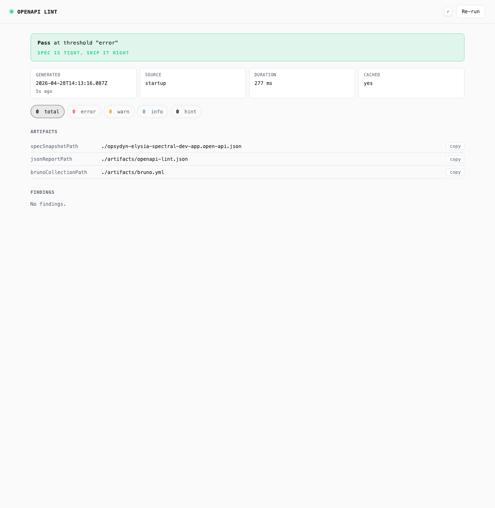
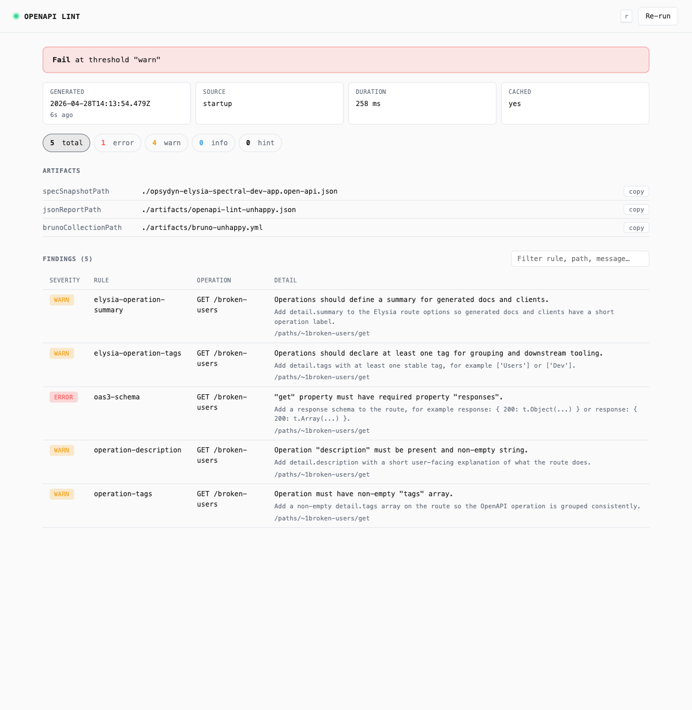
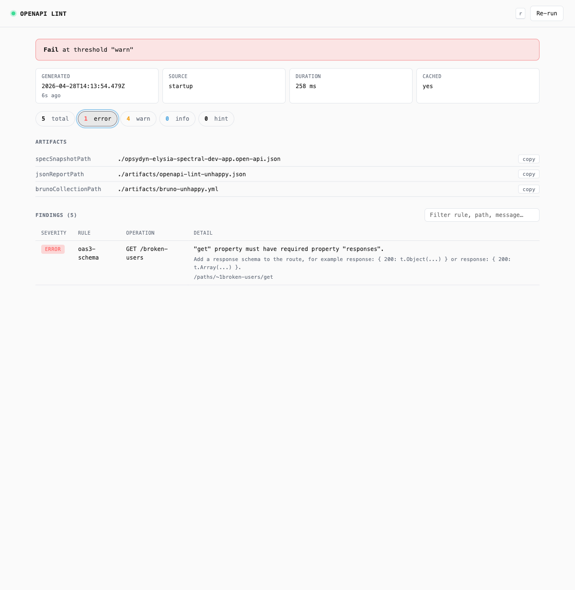

# elysia-spectral workspace

Bun monorepo for the `elysia-spectral` package and its Elysia example app.

## Workspaces

- `packages/elysia-spectral`: publishable Spectral plugin package
- `apps/dev-app`: example Elysia app used for docs, manual testing, and unhappy-path validation

## Getting Started

```bash
bun install
```

Common commands from the repo root:

```bash
bun run lint
bun run lint:fix
bun run dev
bun run dev:unhappy
bun run test
bun run build
bun run typecheck
```

The root `dev` scripts intentionally orchestrate workspace boundaries: they build the publishable package first, then start the example app. Individual workspace scripts stay local to their own package.

Biome is configured at the repo root and enforced via `bun run lint`. The formatter uses the existing repo style: spaces for indentation, single quotes in JS/TS, and semicolons enabled.

## Layout

```text
apps/
  dev-app/
packages/
  elysia-spectral/
project.md
```

## Dashboard

The plugin can mount an HTML dashboard summarizing the latest lint run, useful during local development and in CI preview environments.

```ts
spectralPlugin({
  failOn: 'error',
  dashboard: {
    path: '/api-lint/dashboard', // optional, defaults to /__openapi/dashboard
  },
});
```

Visit the configured path in a browser. Append `?fresh=1` (or click **Re-run**) to bypass the cached result and re-lint the live spec.

The dashboard surfaces:

- **Status banner**: pass/fail at the configured threshold
- **Metadata**: generated timestamp (with relative "Xm ago"), source (`startup`/`runtime`), duration, cache state
- **Counts**: errors, warnings, info, hints, total — click any chip to filter the findings table
- **Artifacts**: paths to the spec snapshot, JSON report, and Bruno collection, with copy-to-clipboard buttons
- **Findings**: per-rule details when the run is not clean, filterable via the search input

### UX shortcuts

- Monospace UI throughout — paths, pointers, and rules read like a terminal
- `r` — re-run the lint (bypasses cache)
- `/` — focus the findings search input
- Click a severity chip to scope findings; click **total** to clear
- Click **copy** on an artifact row to put the path on your clipboard

### Screenshots

| State | Screenshot |
| --- | --- |
| Happy path — `bun run dev` |  |
| Unhappy path — `bun run dev:unhappy` |  |
| After re-run with `?fresh=1` |  |

Screenshots live in `docs/screenshots/` and were captured against the `apps/dev-app` fixture using Playwright MCP. Re-capture them whenever the dashboard markup changes.

## Notes

- Package documentation lives in `packages/elysia-spectral/README.md`.
- The example app consumes the workspace package, keeping the publishable package free of embedded dev routes.
- OpenAPI snapshots produced by the example app are derived from the example app package name and land in that app root.

## Release Automation

GitHub Actions now uses `release-please` for semver automation of `packages/elysia-spectral`.

- `fix:` commits produce a patch release
- `feat:` commits produce a minor release
- `feat!:` or any commit with a `BREAKING CHANGE:` footer produces a major release
- pushes to `main` or `master` update or create a release PR
- merging the release PR tags the release, updates the package version and changelog, and publishes to npm when `NPM_TOKEN` is configured

Repository secrets to configure:

- `NPM_TOKEN`: required for automated npm publish
- optional: a PAT-backed `RELEASE_PLEASE_TOKEN` if you later want release PRs to trigger other workflows instead of relying on the default `GITHUB_TOKEN`

Release config lives in `release-please-config.json`, `.release-please-manifest.json`, and `.github/workflows/release-please.yml`.