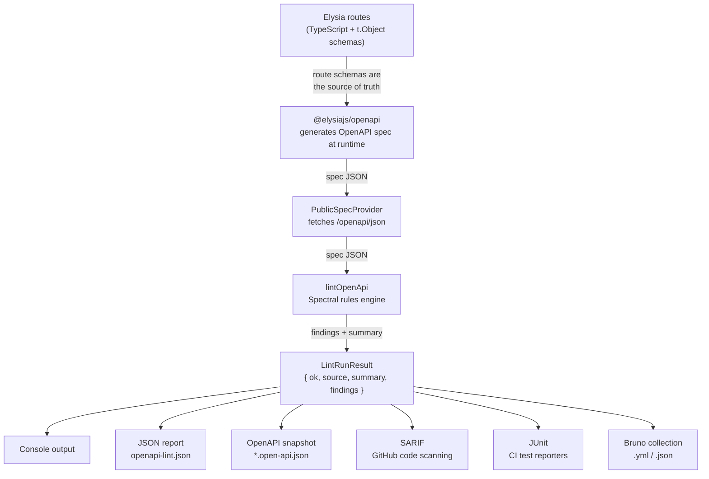
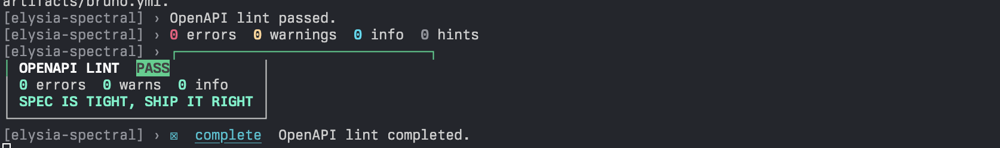
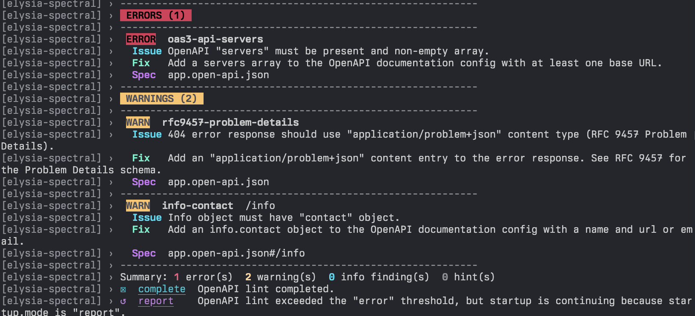

<p align="center">
  
</p>

# @opsydyn/elysia-spectral

Thin Elysia plugin that lints the OpenAPI document generated by `@elysiajs/openapi` with Spectral.

## What Is Elysia?

Elysia is a fast, ergonomic TypeScript web framework for Bun. It uses a plugin model for composing functionality and integrates with `@elysiajs/openapi` to generate OpenAPI documentation directly from route schemas — no separate spec file or annotation layer required.

- Official site: <https://elysiajs.com/>
- `@elysiajs/openapi`: <https://elysiajs.com/plugins/openapi>

## What Is Spectral?

Spectral is an open-source linter and style guide engine for API descriptions. It was built with OpenAPI, AsyncAPI, and JSON Schema in mind, and is commonly used to enforce API style guides, catch weak or inconsistent contract definitions, and improve the usefulness of generated API descriptions.

For API teams, that matters because a spec can be technically valid while still being poor for:

- generated documentation
- client generation
- contract testing
- consistency across teams and services
- long-term API governance

`@opsydyn/elysia-spectral` uses Spectral to turn the OpenAPI document generated by `@elysiajs/openapi` into an automated quality gate for Elysia apps.

Official Spectral references:

- Stoplight overview: <https://stoplight.io/open-source/spectral>
- GitHub repository: <https://github.com/stoplightio/spectral>

## Standards

- RFC 9457 — Problem Details for HTTP APIs: <https://datatracker.ietf.org/doc/html/rfc9457>

The `strict` preset enforces RFC 9457 by requiring that all 4xx and 5xx responses declare `application/problem+json` as their content type.

This README is organized using the Diataxis documentation model:

- Tutorial: learn by building a working setup
- How-to guides: solve specific tasks
- Reference: look up exact behavior and API shape
- Explanation: understand the design choices

Current package scope:

- startup linting
- threshold-based failure
- first-party governance presets: `recommended`, `server`, `strict`
- RFC 9457 Problem Details enforcement (strict preset)
- repo-level and local rulesets
- YAML, JS, TS, and in-memory rulesets
- resolver pipeline for advanced ruleset loading
- console output
- JSON report output
- JUnit report output
- SARIF report output
- OpenAPI snapshot output
- Bruno collection output (OpenCollection YAML or JSON)
- reusable runtime for CI and tests
- opt-in healthcheck endpoint for cached and fresh runs
- opt-in HTML lint dashboard with severity filters, search, and copy-friendly artifact paths

## Data flow



## Tutorial

### Add OpenAPI linting to an Elysia app

This tutorial takes a minimal Elysia app and adds startup OpenAPI linting using the `strict` preset. The `strict` preset is the recommended starting point for teams shipping production APIs — it enforces summaries, descriptions, operation IDs, tags, server declarations, and RFC 9457 Problem Details on error responses.

1. Install the dependencies.

```bash
# bun
bun add elysia @elysiajs/openapi @opsydyn/elysia-spectral

# npm
npm install elysia @elysiajs/openapi @opsydyn/elysia-spectral
```

2. Add `@elysiajs/openapi` and `spectralPlugin` to your app with the `strict` preset.

```ts
import { Elysia, t } from 'elysia'
import { openapi } from '@elysiajs/openapi'
import { spectralPlugin } from '@opsydyn/elysia-spectral'

new Elysia()
  .use(
    openapi({
      documentation: {
        info: {
          title: 'Example API',
          version: '1.0.0',
          contact: { name: 'API Team', url: 'https://example.com/support' }
        },
        servers: [{ url: 'https://api.example.com' }],
        tags: [{ name: 'Users', description: 'User operations' }]
      }
    })
  )
  .use(
    spectralPlugin({
      preset: 'strict',
      failOn: 'error',
      startup: { mode: 'enforce' },
      output: {
        console: true,
        jsonReportPath: './artifacts/openapi-lint.json',
        specSnapshotPath: true
      }
    })
  )
  .get('/users', () => [{ id: '1', name: 'Ada Lovelace' }], {
    detail: {
      summary: 'List users',
      description: 'Return all registered users.',
      operationId: 'listUsers',
      tags: ['Users']
    },
    response: {
      200: t.Array(
        t.Object({ id: t.String(), name: t.String() })
      ),
      500: t.Object(
        {
          type: t.String(),
          title: t.String(),
          status: t.Number(),
          detail: t.String()
        },
        { description: 'Internal server error (RFC 9457 Problem Details)' }
      )
    }
  })
  .listen(3000)
```

The `strict` preset requires error responses to use `application/problem+json` (RFC 9457). The `500` response above satisfies that when `@elysiajs/openapi` generates the schema with the correct content type.

3. Start the app.

```bash
bun run src/index.ts
```

4. Confirm the outcome.

- the app serves OpenAPI JSON at `/openapi/json`
- the plugin lints that generated document during startup using the `strict` preset
- a clean run prints a success banner in the terminal
- `./artifacts/openapi-lint.json` contains the full lint result
- `./<package-name>.open-api.json` contains the generated OpenAPI snapshot

A passing run:



If startup fails, the terminal output includes:

- the failing rule code
- the affected operation
- a fix hint when one is known
- a spec reference in `open-api.json#/json/pointer` form



### Choose a preset

Three first-party presets are available. Import them directly or set `preset` in the plugin options.

| Preset | Use case | elysia rules | description / operationId | servers | RFC 9457 |
|---|---|---|---|---|---|
| `recommended` | local dev, low friction | warn | — | off | — |
| `server` | production API gate | error | warn | warn | — |
| `strict` | full API governance | error | error | error | warn |

```ts
// simplest — preset string
spectralPlugin({ preset: 'strict' })

// or import the preset object and pass as ruleset
import { strict } from '@opsydyn/elysia-spectral'
spectralPlugin({ ruleset: strict })
```

When `preset` is set, autodiscovered `spectral.yaml` overrides merge on top of the preset rather than the package default. This lets you tighten or loosen individual rules without losing the preset baseline.

## How-to Guides

### Use a repo-level ruleset

Use a ruleset file at the consuming app root:

```ts
spectralPlugin({
  ruleset: './spectral.yaml'
})
```

Or let the plugin autodiscover a standard ruleset filename:

```ts
spectralPlugin()
```

Autodiscovery looks for these files in order:

- `spectral.yaml`
- `spectral.yml`
- `spectral.ts`
- `spectral.mts`
- `spectral.cts`
- `spectral.js`
- `spectral.mjs`
- `spectral.cjs`
- `spectral.config.yaml`
- `spectral.config.yml`
- `spectral.config.ts`
- `spectral.config.mts`
- `spectral.config.cts`
- `spectral.config.js`
- `spectral.config.mjs`
- `spectral.config.cjs`

Autodiscovered repo-level rulesets are merged with the package default ruleset.

### Use a JS or TS ruleset module

Module rulesets can export the ruleset as the default export or as a named `ruleset` export.

```ts
export default {
  extends: ['spectral:oas'],
  rules: {
    operation-description: {
      severity: 'error'
    }
  }
}
```

Module rulesets can also export custom Spectral functions:

```ts
const startsWithPrefix = (input, options) => {
  if (typeof input !== 'string' || !input.startsWith(options.prefix)) {
    return [{ message: `OperationId must start with "${options.prefix}".` }]
  }
}

export const functions = {
  startsWithPrefix
}

export default {
  extends: ['spectral:oas'],
  rules: {
    'operation-id-prefix': {
      given: '$.paths[*][get,put,post,delete,options,head,patch,trace]',
      then: {
        field: 'operationId',
        function: 'startsWithPrefix',
        functionOptions: { prefix: 'fetch' }
      }
    }
  }
}
```

### Keep the app running when lint fails at startup

Use `startup.mode: 'report'` when you want the full package-owned terminal report but do not want lint findings to block boot.

```ts
spectralPlugin({
  failOn: 'warn',
  startup: {
    mode: 'report'
  }
})
```

This is useful for local development and intentionally broken fixtures.

### Disable startup lint entirely

Use `startup.mode: 'off'` when you only want manual or healthcheck-triggered runs.

```ts
spectralPlugin({
  startup: {
    mode: 'off'
  }
})
```

`enabled: false` is still supported as a backwards-compatible way to disable startup lint.

### Add a lint healthcheck endpoint

The healthcheck route is opt-in.

```ts
spectralPlugin({
  healthcheck: {
    path: '/health/openapi-lint'
  }
})
```

Behavior:

- `GET /health/openapi-lint` returns the cached startup result when available
- `GET /health/openapi-lint?fresh=1` forces a fresh lint run
- the route returns `200` when findings stay below `failOn`
- the route returns `503` when findings meet or exceed `failOn`
- the route is hidden from generated OpenAPI docs

### Add an HTML lint dashboard endpoint

The dashboard route is opt-in and renders the latest lint result as a self-contained HTML page — no JS bundle, no build step, no external assets.

```ts
spectralPlugin({
  dashboard: {
    path: '/__openapi/dashboard'
  }
})
```

`dashboard: {}` mounts the default path (`/__openapi/dashboard`); pass `path` to override.

What it surfaces:

- pass / fail banner at the configured `failOn` threshold
- run metadata (timestamp, source, duration, cache hit)
- severity summary chips that filter the findings table
- a search input that matches rule code, operation, message, and JSON pointer
- copy-to-clipboard buttons next to artifact paths
- the trademarked `SPEC IS TIGHT, SHIP IT RIGHT` tagline on a clean run

Keyboard shortcuts: `r` re-runs, `/` focuses the filter, `Enter`/`Space` toggles the focused severity chip.

Append `?fresh=1` to force a fresh lint run instead of returning the cached result.

| State | Screenshot |
| --- | --- |
| Pass |  |
| Fail |  |
| Recovered |  |

The dashboard is hidden from generated OpenAPI docs and is intended for local and internal-only environments. Gate it behind your standard auth or environment checks before exposing it on a public host.

### Persist JSON reports and OpenAPI snapshots

```ts
spectralPlugin({
  output: {
    jsonReportPath: './artifacts/openapi-lint.json',
    specSnapshotPath: true
  }
})
```

Snapshot behavior:

- `specSnapshotPath: true` derives `./<package-name>.open-api.json` from the consuming app's `package.json` name
- `specSnapshotPath: './contracts/openapi.json'` writes to the exact relative path you provide
- scoped package names are sanitized, so `@acme/orders-api` becomes `./acme-orders-api.open-api.json`

All report and snapshot paths resolve from the consuming app's `process.cwd()`.

### Emit SARIF for code scanning tools

```ts
spectralPlugin({
  output: {
    sarifReportPath: './artifacts/openapi-lint.sarif'
  }
})
```

SARIF is useful when you want lint results in a standard machine-readable format for platforms such as GitHub code scanning and other static analysis tooling.

### Emit JUnit XML for CI test reporting

```ts
spectralPlugin({
  output: {
    junitReportPath: './artifacts/openapi-lint.junit.xml'
  }
})
```

JUnit is useful when your CI system expects test-style XML output and you want lint findings to appear in standard test reports.

### Add a custom sink

The existing `output` convenience flags are built on top of sink abstractions. You can add your own sink for custom reporting or automation:

```ts
spectralPlugin({
  output: {
    sinks: [
      {
        name: 'capture',
        async write(result, context) {
          console.log(result.summary.total)
          console.log(context.spec.openapi)
        }
      }
    ]
  }
})
```

Custom sinks run after linting and can read:

- the normalized lint result
- the resolved OpenAPI document
- artifact paths already produced by earlier built-in sinks

### Use a custom ruleset resolver pipeline

If you use the runtime programmatically, you can provide your own resolver pipeline to `loadRuleset` or `loadResolvedRuleset`.

```ts
import { loadRuleset } from '@opsydyn/elysia-spectral/core'

const ruleset = await loadRuleset('virtual://team-ruleset', {
  resolvers: [
    async (input) =>
      input === 'virtual://team-ruleset'
        ? {
            ruleset: {
              extends: ['spectral:oas'],
              rules: {
                'team-summary': {
                  given: '$.paths[*][get,put,post,delete,options,head,patch,trace]',
                  then: {
                    field: 'summary',
                    function: 'truthy'
                  }
                }
              }
            }
          }
        : undefined
  ]
})
```

This is an advanced extension point. Most apps should continue using repo-level `spectral.*` files.

### Make artifact write failures fatal in CI

Artifact writes are non-fatal by default. In CI, set them to fatal:

```ts
spectralPlugin({
  output: {
    jsonReportPath: './artifacts/openapi-lint.json',
    specSnapshotPath: true,
    artifactWriteFailures: 'error'
  }
})
```

Use `'warn'` for local development and `'error'` when artifact generation is required.

### Run the runtime in CI

Use `createOpenApiLintRuntime` to run a standalone lint check in CI without starting an HTTP server. Import your Elysia app instance directly — the runtime uses `app.handle()` in-process to retrieve the generated OpenAPI document. No port binding required.

Create a script at `scripts/lint-openapi.ts`:

```ts
import { app } from '../src/app'
import { createOpenApiLintRuntime } from '@opsydyn/elysia-spectral'

const runtime = createOpenApiLintRuntime({
  preset: 'strict',
  failOn: 'error',
  output: {
    console: true,
    sarifReportPath: './reports/openapi.sarif',
    junitReportPath: './reports/openapi.junit.xml',
    specSnapshotPath: './reports/openapi-snapshot.json',
    artifactWriteFailures: 'error',
  },
})

try {
  await runtime.run(app)
  process.exit(0)
} catch {
  process.exit(1)
}
```

Run it as a CI step:

```yaml
- name: Lint OpenAPI spec
  run: bun scripts/lint-openapi.ts
```

### Integrate SARIF with GitHub code scanning

SARIF output maps lint findings to code locations and surfaces them as GitHub code scanning alerts on pull requests.

```yaml
- name: Lint OpenAPI spec
  run: bun scripts/lint-openapi.ts

- name: Upload SARIF to GitHub code scanning
  uses: github/codeql-action/upload-sarif@v3
  with:
    sarif_file: reports/openapi.sarif
  if: always()
```

`if: always()` ensures the SARIF upload runs even when the lint step fails, so findings are visible on failing PRs.

### Report lint findings as JUnit test results

JUnit output lets CI systems that consume test XML (Buildkite, CircleCI, GitLab, GitHub via third-party actions) show lint findings alongside test results.

```yaml
- name: Lint OpenAPI spec
  run: bun scripts/lint-openapi.ts

- name: Publish lint results
  uses: dorny/test-reporter@v1
  with:
    name: OpenAPI Lint
    path: reports/openapi.junit.xml
    reporter: java-junit
  if: always()
```

### Generate a Bruno collection

Export the generated OpenAPI spec as a Bruno collection. Bruno is an open-source API client — generated collections let your team test API endpoints without manual import steps.

The output format is determined by the file extension:

- `.yml` / `.yaml` — OpenCollection YAML (recommended, Bruno v3.0.0+)
- `.json` — Bruno collection JSON (compatible with all Bruno versions)

```ts
// OpenCollection YAML — recommended
spectralPlugin({
  output: {
    brunoCollectionPath: './bruno/collection.yml'
  }
})

// Bruno JSON — for older Bruno versions
spectralPlugin({
  output: {
    brunoCollectionPath: './bruno/collection.json'
  }
})
```

The collection is written after each lint run — at startup, on healthcheck, or in CI. Commit it alongside the spec snapshot so it stays in sync with the API surface.

To regenerate in CI as part of your lint script:

```ts
const runtime = createOpenApiLintRuntime({
  preset: 'strict',
  output: {
    specSnapshotPath: './reports/openapi-snapshot.json',
    brunoCollectionPath: './bruno/collection.yml',
  },
})

await runtime.run(app)
```

### Track OpenAPI snapshot drift

Commit the generated OpenAPI snapshot and use `git diff --exit-code` to detect when the API surface changes unexpectedly in a PR.

1. Generate and commit the initial snapshot:

```bash
bun scripts/lint-openapi.ts
git add reports/openapi-snapshot.json
git commit -m "chore: add openapi snapshot"
```

1. In CI, regenerate the snapshot and check for drift:

```yaml
- name: Lint OpenAPI spec
  run: bun scripts/lint-openapi.ts

- name: Check for snapshot drift
  run: git diff --exit-code reports/openapi-snapshot.json
```

If the snapshot has changed, the CI step fails and the diff is visible in the logs. Deliberate API changes are acknowledged by updating the committed snapshot — accidental ones are caught before they ship.

### Generate a typed client

**If your consumer is a TypeScript project that can import from your Elysia app, use [Eden Treaty](https://elysiajs.com/eden/treaty/overview) instead.** It derives types directly from the app instance with no codegen, no snapshot, and no drift.

```ts
import { treaty } from '@elysiajs/eden'
import type { App } from '../server'

const client = treaty<App>('localhost:3000')
// fully typed — zero codegen
```

For vendor-agnostic consumers — cross-repo TypeScript, non-TypeScript clients, or a published SDK — use the committed OpenAPI snapshot as input to [`openapi-ts`](https://openapi-ts.dev):

```json
{
  "scripts": {
    "generate:client": "openapi-ts --input ./reports/openapi-snapshot.json --output ./src/generated/client --client @hey-api/client-fetch"
  }
}
```

Chain it after the lint step in CI and guard against drift:

```yaml
- name: Lint OpenAPI spec
  run: bun scripts/lint-openapi.ts

- name: Generate typed client
  run: bun run generate:client

- name: Check for client drift
  run: git diff --exit-code src/generated/client/
```

The lint gate runs first — if the spec is invalid the codegen step never runs.

### Work on this repository locally

From the monorepo root:

```bash
bun install
bun run dev
```

That starts `apps/dev-app` with:

- OpenAPI UI at `/openapi`
- raw OpenAPI JSON at `/openapi/json`
- opt-in lint healthcheck at `/health/openapi-lint`
- opt-in HTML lint dashboard at `/api-lint/dashboard`
- JSON lint report output at `./artifacts/openapi-lint.json`
- OpenAPI snapshot output at `./elysia-spectral-dev-app.open-api.json`

To run an intentionally failing fixture:

```bash
bun run dev:unhappy
```

That example uses `startup.mode: 'report'`, so the app still boots while the package prints the full lint report during startup.

## Reference

### Package API

```ts
// ── Vocabulary types ──────────────────────────────────────────────────────────

type PresetName = 'recommended' | 'server' | 'strict'
type LintSeverity = 'error' | 'warn' | 'info' | 'hint'
type SeverityThreshold = 'error' | 'warn' | 'info' | 'hint' | 'never'
type StartupLintMode = 'enforce' | 'report' | 'off'
type LintRunSource = 'startup' | 'healthcheck' | 'manual'
type ArtifactWriteFailureMode = 'warn' | 'error'
type OpenApiLintRuntimeStatus = 'idle' | 'running' | 'passed' | 'failed'

// ── Plugin options ────────────────────────────────────────────────────────────

type SpectralPluginOptions = {
  /** First-party governance preset. Sets the base ruleset and autodiscovery merge target. */
  preset?: PresetName
  /** Custom ruleset path, object, or inline definition. Merged on top of preset when both are set. */
  ruleset?: string | RulesetDefinition | Record<string, unknown>
  /** Severity level at which the lint run is considered failed. Defaults to 'error'. */
  failOn?: SeverityThreshold
  healthcheck?: false | { path?: string }
  dashboard?: false | { path?: string }
  output?: {
    /** Print findings to the console. Default: true. */
    console?: boolean
    jsonReportPath?: string
    junitReportPath?: string
    sarifReportPath?: string
    /** true derives the path from the consuming app's package name. */
    specSnapshotPath?: string | true
    /** .yml/.yaml → OpenCollection YAML (Bruno v3+), .json → Bruno collection JSON */
    brunoCollectionPath?: string
    pretty?: boolean
    /** Whether artifact write failures throw or warn. Default: 'warn'. */
    artifactWriteFailures?: ArtifactWriteFailureMode
    sinks?: OpenApiLintSink[]
  }
  source?: {
    specPath?: string
    baseUrl?: string
  }
  /**
   * Controls startup lint behaviour.
   * startup.mode takes precedence over the legacy enabled option.
   *   'enforce' — lint runs at startup and throws on threshold failure (default)
   *   'report'  — lint runs at startup, prints findings, but never blocks boot
   *   'off'     — startup lint is skipped entirely
   */
  startup?: {
    mode?: StartupLintMode
  }
  /**
   * Legacy enable flag. Prefer startup.mode for new code.
   * false or () => false is equivalent to startup.mode: 'off'.
   * The function form receives process.env for environment-based toggling.
   */
  enabled?: boolean | ((env: Record<string, string | undefined>) => boolean)
  logger?: SpectralLogger
}

// ── Result types ──────────────────────────────────────────────────────────────

type LintFinding = {
  code: string
  message: string
  severity: LintSeverity
  path: Array<string | number>
  documentPointer?: string
  recommendation?: string
  source?: string
  range?: {
    start?: { line: number; character: number }
    end?: { line: number; character: number }
  }
  operation?: {
    method?: string
    path?: string
    operationId?: string
  }
}

type LintRunResult = {
  /** True when no findings meet or exceed the configured failOn threshold. */
  ok: boolean
  generatedAt: string
  /** Where the lint run was triggered from. */
  source: LintRunSource
  summary: {
    error: number
    warn: number
    info: number
    hint: number
    total: number
  }
  artifacts?: OpenApiLintArtifacts
  findings: LintFinding[]
}

type OpenApiLintArtifacts = {
  jsonReportPath?: string
  junitReportPath?: string
  sarifReportPath?: string
  specSnapshotPath?: string
  brunoCollectionPath?: string
}

type OpenApiLintRuntimeFailure = {
  name: string
  message: string
  generatedAt: string
}

// ── Runtime ───────────────────────────────────────────────────────────────────

type OpenApiLintRuntime = {
  status: OpenApiLintRuntimeStatus
  startedAt: string | null
  completedAt: string | null
  durationMs: number | null
  latest: LintRunResult | null
  lastSuccess: LintRunResult | null
  lastFailure: OpenApiLintRuntimeFailure | null
  running: boolean
  run: (app: AnyElysia, source?: LintRunSource) => Promise<LintRunResult>
}

function createOpenApiLintRuntime(options?: SpectralPluginOptions): OpenApiLintRuntime

// ── Extension points (advanced) ───────────────────────────────────────────────

type SpectralLogger = {
  info: (message: string) => void
  warn: (message: string) => void
  error: (message: string) => void
}

type OpenApiLintSinkContext = {
  spec: Record<string, unknown>
  logger: SpectralLogger
}

type OpenApiLintSink = {
  name: string
  write: (
    result: LintRunResult,
    context: OpenApiLintSinkContext,
  ) => undefined | Partial<OpenApiLintArtifacts> | Promise<undefined | Partial<OpenApiLintArtifacts>>
}

type RulesetResolver = (
  input: string | RulesetDefinition | Record<string, unknown> | undefined,
  context: RulesetResolverContext,
) => Promise<ResolvedRulesetCandidate | undefined>

type RulesetResolverContext = {
  baseDir: string
  defaultRuleset: RulesetDefinition
  mergeAutodiscoveredWithDefault: boolean
}

type ResolvedRulesetCandidate = {
  ruleset: unknown
  source?: LoadedRuleset['source']
}

type LoadedRuleset = {
  ruleset: RulesetDefinition
  source?: {
    path: string
    autodiscovered: boolean
    mergedWithDefault: boolean
  }
}

type LoadResolvedRulesetOptions = {
  baseDir?: string
  resolvers?: RulesetResolver[]
  mergeAutodiscoveredWithDefault?: boolean
  /** Override the base ruleset used for autodiscovery merging and the fallback when no ruleset is configured. */
  defaultRuleset?: RulesetDefinition
}

// ── Error classes ─────────────────────────────────────────────────────────────

class OpenApiLintThresholdError extends Error {
  readonly threshold: SeverityThreshold
  readonly result: LintRunResult
}

class OpenApiLintArtifactWriteError extends Error {
  readonly artifact: string
  readonly cause: unknown
}

class RulesetLoadError extends Error {}
```

### Presets

| Preset | Extends | elysia-operation-summary | elysia-operation-tags | operation-description | operation-operationId | oas3-api-servers | info-contact | rfc9457-problem-details |
|---|---|---|---|---|---|---|---|---|
| `recommended` | spectral:oas/recommended | warn | warn | — | — | off | off | — |
| `server` | spectral:oas/recommended | error | error | warn | warn | warn | off | — |
| `strict` | spectral:oas/recommended | error | error | error | error | error | warn | warn |

All three presets are exported as `RulesetDefinition` objects and can be passed directly to `ruleset` if you need to compose them:

```ts
import { strict } from '@opsydyn/elysia-spectral'

spectralPlugin({
  ruleset: {
    ...strict,
    rules: {
      ...(strict.rules as object),
      'rfc9457-problem-details': 'error' // escalate to error for this service
    }
  }
})
```

### Runtime state

The runtime object exposes:

- `status`: `idle | running | passed | failed`
- `startedAt`: ISO timestamp for the most recent run start
- `completedAt`: ISO timestamp for the most recent run completion
- `durationMs`: duration of the most recent run
- `latest`: last completed lint result
- `lastSuccess`: last successful lint result
- `lastFailure`: last thrown runtime error summary
- `running`: boolean convenience flag

When used as a plugin, the runtime is also available on `app.store.openApiLint`.

### Healthcheck response shape

Example successful response:

```json
{
  "ok": true,
  "cached": true,
  "threshold": "error",
  "result": {
    "ok": true,
    "generatedAt": "2026-04-06T12:00:00.000Z",
    "source": "startup",
    "summary": {
      "error": 0,
      "warn": 0,
      "info": 0,
      "hint": 0,
      "total": 0
    },
    "findings": []
  }
}
```

### Ruleset resolution

- ruleset paths resolve from the consuming app's `process.cwd()`
- in a typical service repo, `./spectral.yaml` means the repo root
- in this monorepo, `apps/dev-app` resolves `./spectral.yaml` from `apps/dev-app`
- supported local ruleset files are `.yaml`, `.yml`, `.js`, `.mjs`, `.cjs`, `.ts`, `.mts`, and `.cts`
- module rulesets may export the ruleset as the default export or a named `ruleset` export
- module rulesets may export `functions` to register custom Spectral functions
- in-memory ruleset objects are supported
- `loadRuleset` and `loadResolvedRuleset` also accept an options object with a custom `resolvers` pipeline
- autodiscovered rulesets merge with the package default ruleset by default and can opt out with `mergeAutodiscoveredWithDefault: false`

### Error behavior

- startup mode `enforce` throws on threshold failures
- startup mode `report` prints the same lint report but allows boot to continue on threshold failures
- startup mode `off` skips startup lint
- bad `source.specPath` or invalid spec JSON produces an actionable provider error
- artifact writes warn by default and can be made fatal with `output.artifactWriteFailures: 'error'`

### Output model

The current output model has two layers:

- convenience options such as `jsonReportPath`, `junitReportPath`, `specSnapshotPath`, `sarifReportPath`, and `brunoCollectionPath`
- sink abstractions under `output.sinks`

The convenience options compile down to built-in sinks so the current API stays simple while the internal output model becomes extensible.

## Explanation

### Why this package exists

`@opsydyn/elysia-spectral` is meant to add contract-quality feedback to Elysia APIs without inventing a second schema system. The source of truth remains the route metadata and response schemas you already define for `@elysiajs/openapi`.

### How it works

The plugin does not inspect private `@elysiajs/openapi` internals. It resolves the generated OpenAPI JSON document through Elysia's public `app.handle(new Request(...))` API, using `source.specPath` or the default `/openapi/json`.

If `source.baseUrl` is configured, the provider can also fall back to loopback HTTP fetch. This keeps spec resolution on public surfaces rather than framework internals.

### Why startup and healthcheck are separate

Startup linting and route exposure solve different problems:

- startup linting protects boot and local feedback loops
- healthchecks expose operational state to external callers
- the dashboard turns the same cached result into a human-readable page

Separating them avoids a production surprise where enabling linting also adds a route you did not intend to expose. Each route is opt-in, so dashboards stay off by default and never leak into generated OpenAPI docs.

### Why repo-level rulesets are the default customization path

Teams usually want policy to live with the service, not inside library code. A repo-level ruleset keeps API governance close to the app, easy to review in pull requests, and easy to override without forking this package.

That is why `spectralPlugin()` can autodiscover a repo-level ruleset and merge it with the package defaults.

### Why the runtime is exported separately

The runtime exists so the same linting behavior can run in:

- app startup
- healthcheck-triggered manual runs
- CI pipelines
- tests

That keeps the plugin thin while still giving teams a stable programmatic surface for automation.

### Why runtime state is tracked explicitly

Production-grade linting needs more than a pass/fail boolean. The runtime tracks status, timestamps, last success, and last failure so operators and automated systems can understand what happened without re-running lint blindly.

### Project status

The package is actively developed toward a stable `v1`. Milestones 0.2 through 0.6 are complete. Ongoing work is tracked in [roadmap.md](../../roadmap.md).
